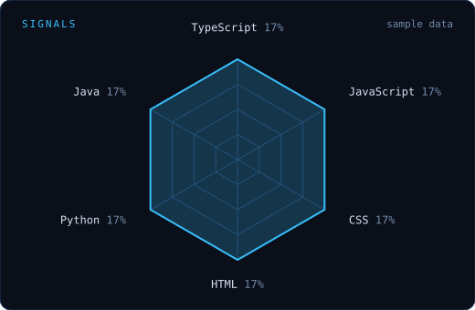

**Fullstack Web & Mobile Developer** · Software Engineering @ IFRI (UAC), Bénin · [Affo Dev](https://github.com/Krisaff7)

---

## 👋 This is me

Hi, I'm **Kris**, a 3rd-year Software Engineering student at IFRI (Université d'Abomey-Calavi, Bénin). I build web and mobile apps with Next.js and React Native, and I run **Affo Dev**, my freelance fullstack studio. My next goal: a Master's in **DevOps & Cloud**.

- 🌍 Based in Abomey-Calavi, Bénin
- 🛠️ Building fullstack web & mobile products
- 🎯 Heading towards DevOps & Cloud

🇫🇷 Version française

 

Salut, moi c'est **Kris**, étudiant en 3ᵉ année de Génie Logiciel à l'IFRI (Université d'Abomey-Calavi, Bénin). Je développe des applications web et mobile avec Next.js et React Native, et je dirige **Affo Dev**, mon studio freelance fullstack. Mon prochain objectif : un Master **DevOps & Cloud**.

- 🌍 Basé à Abomey-Calavi, Bénin
- 🛠️ Je construis des produits fullstack web & mobile
- 🎯 Cap sur le DevOps & le Cloud

---

## ⚙️ My perfect stack

## 📡 Signals

Auto-updated daily by GitHub Actions

---

